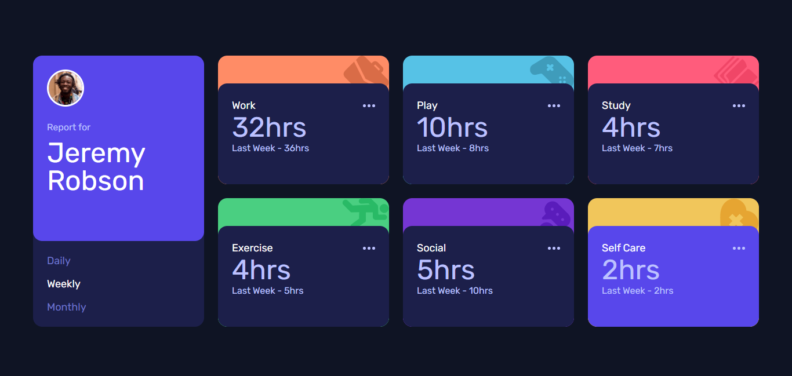

# Frontend Mentor - Time tracking dashboard solution

This is a solution to the [Time tracking dashboard challenge on Frontend Mentor](https://www.frontendmentor.io/challenges/time-tracking-dashboard-UIQ7167Jw). Frontend Mentor challenges help you improve your coding skills by building realistic projects.

## The challenge

Users should be able to:

- View the optimal layout for the site depending on their device's screen size
- See hover states for all interactive elements on the page
- Switch between viewing Daily, Weekly, and Monthly stats

## Screenshot

## Links

- Solution URL: [Solution URL](https://github.com/JustShuaib/time-tracking-dashboard)
- Live Site URL: [Live site URL](https://dashboard-shuaib.netlify.app/)

## Built with

- Semantic HTML5 markup
- [Tailwind](https://tailwindcss.com/)
- Mobile-first workflow
- JavaScript

## Useful resources

- [Aborting a fetch request](https://typeofnan.dev/how-to-abort-a-fetch-request-in-javascript-using-abortcontroller/) - I used this article to learn more about using the abort controller

## Author

- Github - [Adeoti Shuaib](https://www.github.com/JustShuaib)
- Frontend Mentor - [@justshuaib](https://www.frontendmentor.io/profile/justshuaib)
- Twitter - [@JustShuaib](https://www.twitter.com/JustShuaib)
